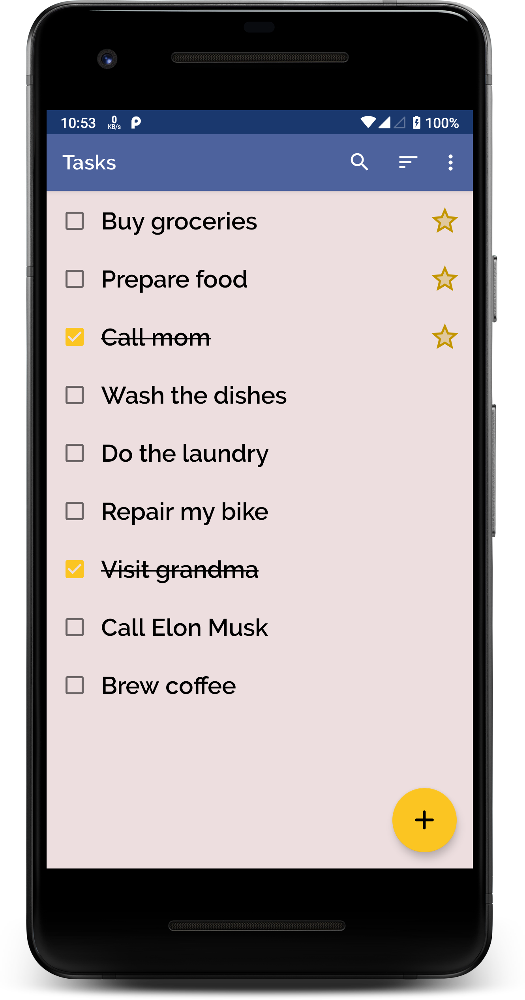
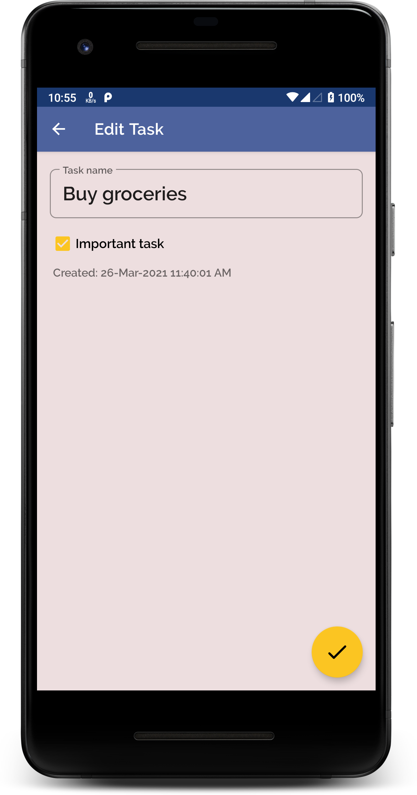

# Tasks

An Android app that shows a list of tasks as a todo list, sorted by the order of importance. The user can create, edit, delete, sort and search for tasks.

> You can find the debug APK file in [Releases](https://github.com/AtriTripathi/Tasks/releases).

## Screenshots

&ensp;&ensp;

## Architecture - MVVM

`MVVM (Model-View-ViewModel) Architecture` combines the advantages of separation of concerns provided by MVP, while maintaining testability. This results in a pattern where the model drives as many of the operations as possible, minimizing the logic in the view.

## Libraries Used

### [Jetpack Libraries](https://developer.android.com/jetpack)

Jetpack is a suite of libraries to help follow best practices, reduce boilerplate code, and write code that works consistently across Android versions and devices.

### [Architecture Components](https://developer.android.com/topic/libraries/architecture)

Android Architecture Components like `ViewModel`, `LiveData`and Lifecycle-aware components are implemented in this app for a more robust, testable and maintainable codebase.

### [Dagger-Hilt](https://dagger.dev/hilt/)

`Dagger-Hilt` is responsible for Dependency Injection throughout the app. It is used to inject dependencies like `Room` instance and `ViewModels`.

### [Coroutines](https://kotlinlang.org/docs/coroutines-overview.html)

`Coroutines` is used to execute code in an asynchronous and non-blocking way. It is heavily used in the `ViewModels` and also to make databse requests to the Room instance.

### [Room](https://developer.android.com/jetpack/androidx/releases/room)

`Room` persistence library provides an abstraction layer over SQLite to allow for more robust database access. It provides compile-time query verification, convenience annotations and less boilerplate code.

### [Navigation Components](https://developer.android.com/guide/navigation)

Navigation components is used to handle fragment transactions, and Up and Back actions correctly by default. It simplifies navigation and passing data between destinations in a type-safe way using `Safe Args`.

### [View Binding](https://developer.android.com/topic/libraries/view-binding)

View Binding is used to ensure compile-time safety for accessing the view hierarchy. It creates an instance of a binding class that contains direct references to all views that have an ID in the corresponding layout.

### [Data Store](https://developer.android.com/topic/libraries/architecture/datastore)

`DataStore` is a data storage solution that allows you to store user preferences using key-value pairs or typed objects. It uses Kotlin coroutines and Flow to store data asynchronously, consistently, and transactionally.

### [Material Components](https://material.io/develop/android/)

Material Components provide beautiful UI elements with a lots of customizations. It is used as it defines the latest standards for design by Google.

## Developed By

### Atri Tripathi

 

[atritripathi.com](https://atritripathi.com)

## License

    Copyright 2021 Atri Tripathi

    Licensed under the Apache License, Version 2.0 (the "License");
    you may not use this file except in compliance with the License.
    You may obtain a copy of the License at

        http://www.apache.org/licenses/LICENSE-2.0

    Unless required by applicable law or agreed to in writing, software
    distributed under the License is distributed on an "AS IS" BASIS,
    WITHOUT WARRANTIES OR CONDITIONS OF ANY KIND, either express or implied.
    See the License for the specific language governing permissions and
    limitations under the License.
